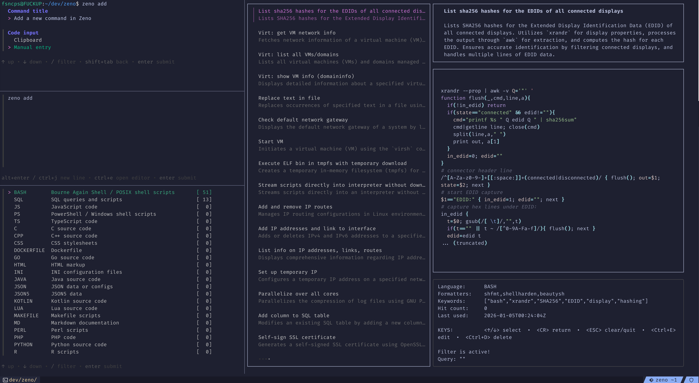

# zeno

A fast, lightweight command and code snippet cheat sheet manager. Build your own searchable database of frequently-used commands instead of asking ChatGPT every time. Built with Go and the [Charm](https://github.com/charmbracelet) TUI stack (Bubble Tea, Lipgloss, Huh).



## Features

- **Interactive Search UI** — Fuzzy filtering across title, description, keywords, and code content with real-time results
- **Adaptive Ranking** — Search results ordered by usage frequency and recency; frequently-used commands surface to the top
- **Syntax Highlighting** — Code blocks displayed with [Chroma](https://github.com/alecthomas/chroma) highlighting in catppuccin-macchiato theme
- **AI-Powered Descriptions** — OpenAI GPT-4o-mini generates descriptions and keywords when adding new commands
- **Smart Language Detection** — Language picker auto-sorts by usage frequency; common aliases normalized (e.g., `js` → `javascript`)
- **Quick Add** — Paste from clipboard, add title, pick language — done
- **Inline Editing** — Press `Ctrl+E` to edit any command directly from the search UI
- **Keyboard-Driven** — Full keyboard navigation, no mouse needed

## Usage

```
$ zeno help
Zeno is a command and snippet cheat sheet manager. Write your
oft-used commands to a DB and retrieve them when needed.

Usage:
  zeno            Start search UI
  zeno search     Start search UI (explicit)
  zeno add        Add a new command snippet
  zeno help       Show this help

Environment:
  ZENO_NO_AI=1    Disable AI helpers when adding commands
```

### Search UI (`zeno` or `zeno search`)

| Key | Action |
|-----|--------|
| `↑/↓` | Navigate command list |
| `Enter` | Copy selected command to clipboard and exit |
| `Esc` | Clear filter / Exit |
| `Ctrl+E` | Edit selected command |
| `Ctrl+D` | Delete selected command (with confirmation) |
| Type | Fuzzy filter across all fields |

The left panel shows the command list with title and description. The right panel displays the full code with syntax highlighting, title, description, language, formatters, keywords, usage count, and last used timestamp.

### Add Command (`zeno add`)

Interactive form flow:

1. **Title** — Short name for the command
2. **Code** — The command/snippet (auto-filled from clipboard if available)
3. **Language** — Programming language (sorted by usage frequency)
4. **Formatters** — Optional formatter tools (e.g., `prettier`, `black`)

AI automatically generates a description and extracts keywords if `$OPENAI_API_KEY` is set. Set `ZENO_NO_AI=1` to disable.

### Example Workflow

```bash
# Copy a command to clipboard
$ echo 'docker ps --filter "status=running" --format "table {{.Names}}\t{{.Status}}"' | pbcopy

# Add it
$ zeno add
  Title: List running containers
  Code: [pasted from clipboard]
  Language: bash
  Formatters: -
  Description: [AI-generated: Lists all running Docker containers...]
  Keywords: [docker, containers, running, ps]

# Later, find it
$ zeno search
  [type: docker running]
  → Select with Enter → copied to clipboard
```

## Requirements

- Go 1.24+
- MariaDB (or MySQL-compatible database)
- OpenAI API key (optional, for AI descriptions)

## Installation

### 1. Database Setup

Create a database and user:

```sql
CREATE DATABASE zeno;
CREATE USER 'zeno'@'localhost' IDENTIFIED BY 'your_password';
GRANT ALL PRIVILEGES ON zeno.* TO 'zeno'@'localhost';
FLUSH PRIVILEGES;
```

Import the schema:

```bash
mysql -u zeno -p zeno < zenoschema.sql
```

### 2. Environment Variables

```bash
export ZENODB_USER=zeno
export ZENODB_PASS=your_password
export ZENODB_HOST=localhost  # optional, defaults to localhost
export ZENODB_PORT=3306      # optional, defaults to 3306
export ZENODB_NAME=zeno
export OPENAI_API_KEY=sk-... # optional, for AI descriptions
```

### 3. Build & Install

```bash
git clone https://github.com/fsncps/zeno.git
cd zeno
make
sudo make install  # installs to /usr/local/bin/zeno
```

## Database Schema

| Table | Purpose |
|-------|---------|
| `language` | Programming languages with optional formatter binary |
| `command` | Snippets (title, description, code, keywords, embedding, usage count) |
| `search_term` | Unique search terms with usage count |
| `search_hit` | Links terms to commands with per-pair hit counts for adaptive ranking |

## Roadmap

- [ ] Vector embeddings for semantic similarity search
- [ ] Tag-based organization
- [ ] Import/export functionality
- [ ] Multi-database support

## License

MIT